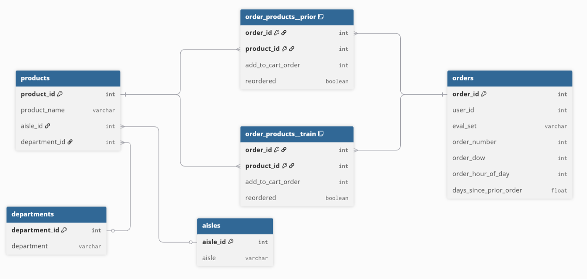

# SKN15-2nd-4Team

# 1. 팀 소개

## 팀명 : 내 물품좀 4조

| 강민정 | 김민규 | 신지혜 | 이세진 | 임경원 | 조태민 |
|:---:|:---:|:---:|:---:|:---:|:---:|
| [@kmj212936](https://github.com/kmj212936) | [@kmklifegk](https://github.com/kmklifegk) | [@jyedu](https://github.com/JYEDU) | [@isjini](https://github.com/isjini) | [@KYUNGWON-99](https://github.com/KYUNGWON-99) | [@sunsnu](https://github.com/sunsnu) |

# 2. 프로젝트 기간
- 2025.07.10 ~ 2025.07.11 (총 2일)

# 3. 프로젝트 개요

## 📕 프로젝트명
- Instacart (미국의 온라인 기반 신선식품 배송 서비스) 고객 이탈 예측 및 마켓팅 대시보드 

## ✅ 프로젝트 배경 및 목적
- 현대 이커머스 시장에서는 신규 고객 유치보다 기존 고객 유지가 더 중요해지고 있음
- 정기적으로 생필품을 구매하는 온라인 식료품 플랫폼에서는 고객의 구매 루틴이 끊기면 재이탈 가능성이 높음
- Instacart 데이터를 기반으로, 고객의 이탈 징후를 조기 탐지하고 개인화된 마케팅 전략을 제안할 수 있는 대시보드를 제작함으로써, 실질적인 고객 유지 및 매출 향상을 도모하고자 함

## 🖐️ 프로젝트 소개
- 고객의 주문 간격, 재구매 패턴, 구매 요일과 시간 등 다양한 요소를 기반으로 이탈 가능성이 높은 고객을 분석
- 이탈 가능성이 높은 고객을 AI 모델을 이용하여 예측하고자 함
- 상품별 판매 순위와 구매 트렌드를 한눈에 파악할 수 있는 대시보드를 제공
- 고객별 특성에 따라 맞춤형 마케팅 전략을 제안

## ❤️ 기대효과
- 📈 고객 이탈률 감소 및 고객 유지율 향상
- 💡 데이터를 바탕으로 한 개인화 마케팅 전략 제안
- 🔁 자주 구매하던 고객의 루틴 기반 리마인드 마케팅 실행
- 🛒 충성 고객과 신규 고객을 구별하여 차별화된 전략 제공
- 🎯 마케팅 및 CRM 팀의 업무 의사결정 지원 도구로 활용

## 👤 대상 사용자
- 🧑‍💼 마케팅/CRM 담당자
    - 고객별 특성을 바탕으로 차별화된 마케팅 전략 수립
    - 휴면 고객 캠페인, 추천 캠페인에 활용
    - 이탈 고객 타겟 마케팅 : 이탈 위험군에 대한 리마인드, 할인 쿠폰, 재구매 유도
    - 충성 고객 리워드 전략 : 재구매율이 높은 고객에 로열티 부여
    - 고객 이탈원인 분석 :  이탈한 고객이 마지막으로 구매한 제품을 카운트해서 공통적인 제품을 특정해 이탈 사유 파악

- 📊 데이터 분석가/BI팀
    - 고객 구매 패턴 인사이트 추출
    - 상품별 성과 분석 및 시각화 자료 생성
    - 고객 행동 구매 패턴 연구 : 제품군별 장바구니에 담은 순서에 따른 구매율을 분석하고, 제품 카테고리별 구매율이 높아지는 조합을 특정. 
이에 따라 고객이 더 많은 상품을 연쇄적으로 구매하도록 관련 제품 노출

- 🛍️ 이커머스 운영자/기획자
    - 고객 세분화를 통해 서비스 UX 개선
    - 상품 진열/추천 전략 수립
    - 상품 구성 최적화 :  이탈 고객이 많이 발생한 상품 및 카테고리 분석을 통해 개선
    - 재구매율이 낮은 상품의 프로모션 및 재고 관리 전략 수립

# 4. 기술 스택

# 5. 수행결과(분석 및 예측 결과)
1. ERD

 

3. 이탈 정의

이 프로젝트에서는 고객 특성별 특정일 이상 미구매한 고객을 이탈 위험 고객으로 정의

마지막 주문 후 경과일(days_since_prior_order)을 기준으로 미구매한 고객을 이탈 위험 고객으로 간주

또한, 마지막 주문 이후 구매 주기를 고려하여 평균 이상으로 비활성 상태인 고객도 포함

4. 이탈 가능성 예측 모델링

   
5. 화면 구성

# 6. 한 줄 회고

조태민 :

두번째 프로젝트를 진행하면서 직접 구현하는 재미를 느낄 수 있었습니다. 처음으로 프로젝트의 팀장을 맡게 되었는데, 각 조원들과 협업하며 여러가지 작업을 동시에 하기 위해서는 체계적인 운영이 필요함을 느꼈습니다. 진행 상황을 공유할 때도 어떤 단계의 정보를 어떻게 진행하고 있고, 누구에게 분배되었는지를 파악하는 것이 중요했지만 생각만큼 잘 되지 못한 것 같습니다. 훌륭한 팀원들을 만나 많은 도움을 받았지만, 개인적으로 아쉬움이 많이 남는 것 같습니다.

김민규 :

훌륭한 팀원들을 만나 많은 도움을 받아 수업때 제대로 이해하지 못했던 부분을 이해할 수 있게 되어 좋은 경험인것 같습니다. 또한 이번 조는 체계적으로 역할분담이 되어 각자 맡은 임무가 있어 책임감이 더욱 생기는 프로젝트였던 것 같습니다.

임경원 :

체계적인 협업이 되기 위한 다양한 의사소통, 각 모듈의 특징에 대한 이해 등 두 번째 프로젝트를 통해 많은 것을 배워 성장한 것 같습니다.

이세진 :

두 번째 프로젝트에서 여러가지를 수행하며, 좋은 팀원들을 만나 도움을 받으며 발전할 수있는 행복한 시간이었습니다. 서로 역할을 나누고 협업하며 프로젝트를 완성해가는 과정에서 실전 감각과 커뮤니케이션의 중요성을 배웠습니다.

강민정 :

2차 프로젝트를 통해 고객 이탈 정의부터 예측 모델까지 실습하며 수업 내용을 프로젝트에 적용해보았고, 등급 분류 및 시각화를 했습니다. 팀원들과의 협업을 통해 부족한 부분을 보완할 수 있었고 수업 중에 배웠던 내용들을 익힐 수 있어 좋은 경험이었습니다.

신지혜 :

2차 프로젝트에서 하고싶은 것이 많았던 만큼 조금 어려울 수도 있는 주제를 선정하였지만, 집단지성으로 팀원들과 함께 업무를 분담하여 하나씩 답을 찾아나갔다. 프로젝트를 하면서 배웠던 내용들을 천천히 복기할 수 있었고, 협업을 통해 서로의 역량을 보완할 수 있었다.

